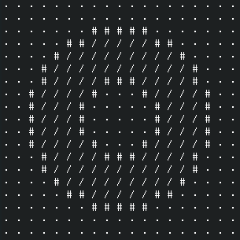

A library that implements many common operations over generic 2D matrices.
This came about after having implemented the same flood-fill, neighbor
selection, and other operations in multiple grid-based game projects.

The core of this library is the `VecGrid<T>` type along with its selection and
flood iterators.

The flood iterator takes a starting coordinate and a predicate, and executes
a flood fill to return all the recursively adjacent coordinates satisfying
the predicate (such as being the same color in a paint program).

The selection iterator takes a collection of coordinates and returns the
values of each of the cells. The returned values of the flood iterator, as
well as the various "patterns" that exist (line, rect, neighbors) can be
plugged into this in order to access and mutate collections of grid cells.

## Ring Example

```
cargo run --example ring
```

